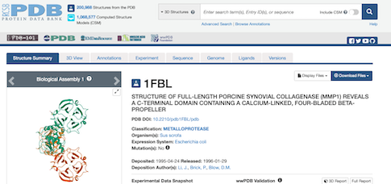
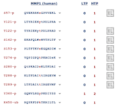
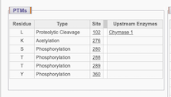
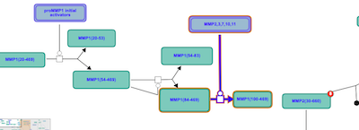
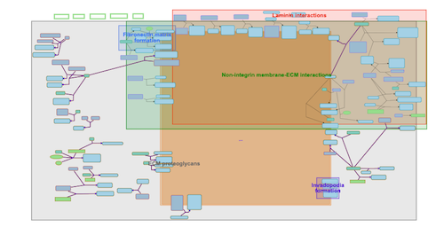
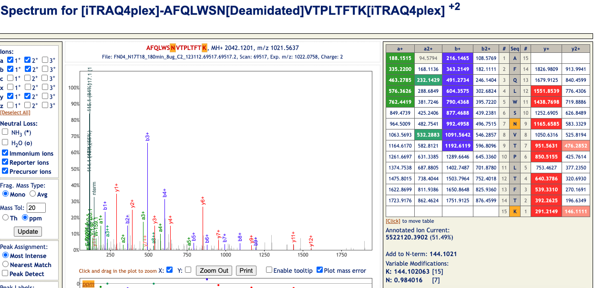

The goal of this exploration is to become more familiar on protein databases by conduction an exploration on MMP1. **Matrix metalloprotease 1 (MMP1)** is a human protein involved in a number of different diseases, especially cancer. It degrades collagen and other highly insoluble substrates and is therefore crucial for the integrity and flexibility of tissues.

**1. What is the gene symbol and the uniprot id for human MMP1?**  
MMP1 is also found in other organisms. When we select for 'human' in UniProt, we see the ID is *P03956*. The gene symbol is MMP1 and CLG is a synonym. The secondary Accession is *P08156*

Source:
https://www.uniprot.org/uniprotkb/P03956/entry

 
**2. What is the pdb code for its structure? Copy and paste an image of its structure here8**  

The PDB code for its structure is 1FBL  

 

Source: https://www.rcsb.org/structure/1FBL

**3. Is MMP1 phosphorylated? If yes, where (at what position) and at what amino acids?**  

According to phosphosite.org-a database for post translational modifications- there are 10 phosphorylated sites found by high throughput papers and only one was found by both high throughput and low throghput. See below for the exact sites that are phosphorylated. There is interestingly, one ubiquitylation listed in residue 450. 

 

Source: https://www.phosphosite.org/proteinAction.action?id=15877&showAllSites=true

**4. Are there any other posttranslational modifications in MMP1. Use at least two different databases to compare and contrast your answer based on each.**  
As mentioned in item 3 above, phosphosite.org lists one ubiquitylation in residue 450. HPRD lists some of the same modifications but also shows an acetylation at K276 and a site for proteolytc cleavage at site L102. Also, GPM lists only two phosphorylated sites. In this case, phosphosite.org offers the longest list of PTMs.

Source: http://hprd.org/summary?hprd_id=00384&isoform_id=00384_1&isoform_name=Isoform_1   
Source: http://gpmdb.thegpm.org/~/dblist_label/label=ENSP00000322788&proex=-1   

**5. Is MMP1 involved in any pathways?** 
To investigate pathways, I am querying Reactome and KEGG. MMP1 is listed in the pathway called 'Autocatalytic activation of MMP1' which describes how MMP1 is turned into its active form by pro-MMP1 initial activators (See zoomed-in and zoomed-out pathways below.). MMP1 is tightly linked with Extra-Cellular Matrix Proteoglycans and after a series of interconnected downstream steps, is involved in the degradation of collagen. 

Source: https://reactome.org/content/detail/R-HSA-1604367

**6. Was MMP1 found in any 2d gel, if yes, provide the image of the gel (or if there are two or more different conditions compared in one study, discuss similarities and differences for different gems with respect to MMP1.** 

**7. What is MMP1’s mass? Have peptides derived from MMPP1 been found in any samples? Show the corresponding mass spectra** 

The mass of MMP1 is 	1751.92 (average molecular weight). According to the peptide atlas, there are 115 derived peptides and some have been experimentally observed. For example, the peptide AFQLWSNVTPLTFTK with accession PAp01662434 has the corresponding spectra below. This spectra for example, ahs some post translational modifications. 

Source: https://db.systemsbiology.net/sbeams/cgi/PeptideAtlas/GetPeptide?_tab=3&atlas_build_id=550&searchWithinThis=Peptide+Name&searchForThis=PAp01662434&action=QUERY
